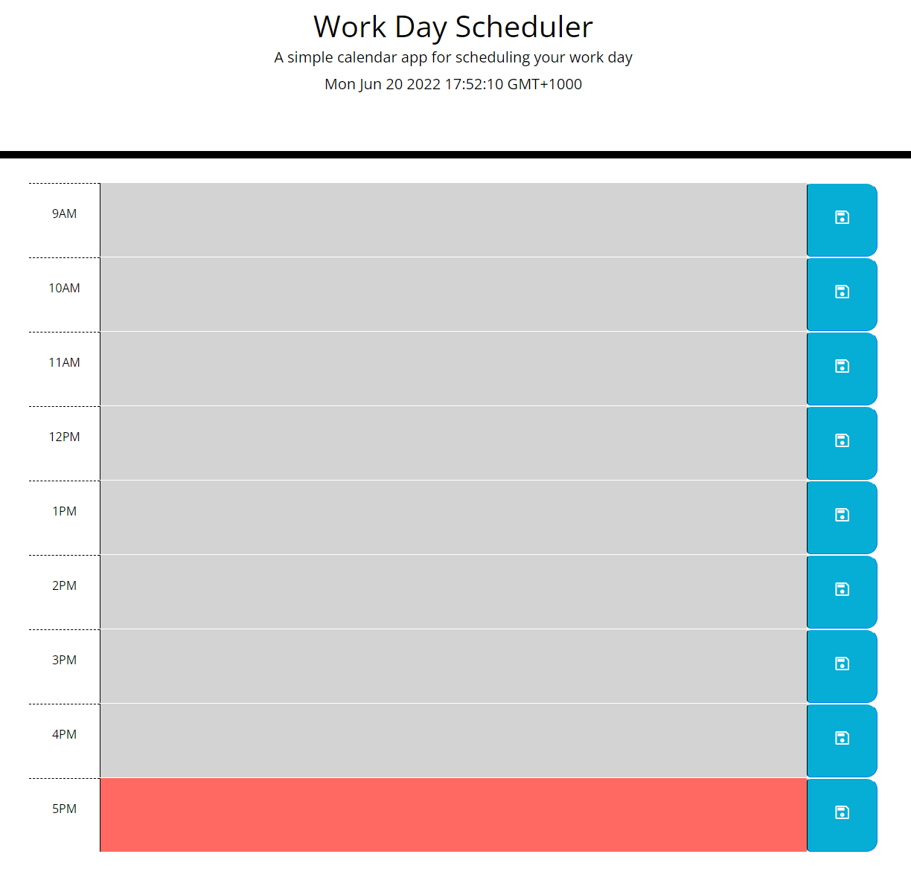

<h1>Work Day Scheduler</h1>

<h2>Description</h2>
This project was built as a way for users to organise their tasks for the standard work day.

<h2>How to Run the Application</h2>
You can run the application by clicking this <a href="https://ghassanalassadi.github.io/work-day-scheduler/">link</a>.

<h2>Screenshot</h2>
